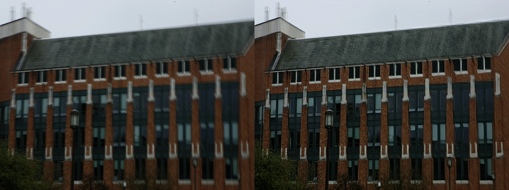

# Image Processing C++ Demo

This demo processes the image according to the selected type of processing. At this moment demo can work with the next types:

* `super_resolution`
* `deblurring`

## Examples

Exmaple for deblurring type (left - source image, right - image after deblurring):



Example for super_resolution type:

Low resolution:


Bicubic interpolation:


Super resolution:


## How It Works

Before running the demo, user must choose type of processing and model for this processing. \
For `super_resolution` user can choose the next models:

* [single-image-super-resolution-1032](../../../../models/intel/single-image-super-resolution-1032/description/single-image-super-resolution-1032.md) -  It enhances the resolution of the input image by a factor of 4.
* [single-image-super-resolution-1033](../../../../models/intel/single-image-super-resolution-1033/description/single-image-super-resolution-1033.md) -  It enhances the resolution of the input image by a factor of 3.
* [text-image-super-resolution-0001](../../../../models/intel/text-image-super-resolution-0001/description/text-image-super-resolution-0001.md) -  A tiny model to 3x upscale scanned images with text.

For `deblurring` user can use [deblurgan-v2](../../../../models/public/deblurgan-v2/deblurgan-v2.md) - generative adversarial network for single image motion deblurring.

The demo runs inference and shows results for each image captured from an input. Depending on number of inference requests processing simultaneously (-nireq parameter) the pipeline might minimize the time required to process each single image (for nireq 1) or maximizes utilization of the device and overall processing performance.

> **NOTE**: By default, Open Model Zoo demos expect input with BGR channels order. If you trained your model to work with RGB order, you need to manually rearrange the default channels order in the demo application or reconvert your model using the Model Optimizer tool with `--reverse_input_channels` argument specified. For more information about the argument, refer to **When to Reverse Input Channels** section of [Converting a Model Using General Conversion Parameters](https://docs.openvinotoolkit.org/latest/_docs_MO_DG_prepare_model_convert_model_Converting_Model_General.html).

## Running

Running the application with the `-h` option yields the following usage message:

```
./image_processing_demo -h
[ INFO ] InferenceEngine: <version>

image_processing_demo_async [OPTION]
Options:

    -h                        Print a usage message.
    -pt "<type>"              Required. Type of processing: super_resolution, deblurring
    -i "<path>"               Required. An input to process. The input must be a single image, a folder of images, video file or camera id.
    -m "<path>"               Required. Path to an .xml file with a trained model.
    -o "<path>"               Optional. Name of output to save.
    -limit "<num>"            Optional. Number of frames to store in output. If 0 is set, all frames are stored.
      -l "<absolute_path>"    Required for CPU custom layers. Absolute path to a shared library with the kernel implementations.
          Or
      -c "<absolute_path>"    Required for GPU custom kernels. Absolute path to the .xml file with the kernel descriptions.
    -d "<device>"             Optional. Specify the target device to infer on (the list of available devices is shown below). Default value is CPU. Use "-d HETERO:<comma-separated_devices_list>" format to specify HETERO plugin. The demo will look for a suitable plugin for a specified device.
    -pc                       Optional. Enables per-layer performance report.
    -nireq "<integer>"        Optional. Number of infer requests. If this option is omitted, number of infer requests is determined automatically.
    -nthreads "<integer>"     Optional. Number of threads.
    -nstreams                 Optional. Number of streams to use for inference on the CPU or/and GPU in throughput mode (for HETERO and MULTI device cases use format <device1>:<nstreams1>,<device2>:<nstreams2> or just <nstreams>)
    -loop                     Optional. Enable reading the input in a loop.
    -no_show                  Optional. Do not show processed video.
    -u                        Optional. List of monitors to show initially.
```

Running the application with the empty list of options yields an error message.

To run the demo, you can use public or pre-trained models. To download the pre-trained models, use the OpenVINO [Model Downloader](../../../tools/downloader/README.md). The list of models supported by the demo is in [models.lst](../models.lst).

> **NOTE**: Before running the demo with a trained model, make sure the model is converted to the Inference Engine format (\*.xml + \*.bin) using the [Model Optimizer tool](https://docs.openvinotoolkit.org/latest/_docs_MO_DG_Deep_Learning_Model_Optimizer_DevGuide.html).

You can use the following command to enhance the resolution of the images captured by a camera using a pre-trained single-image-super-resolution-1033 network:

```sh
./image_processing_demo -i 0 -m single-image-super-resolution-1033.xml -at super_resolution
```

## Demo Output

The demo uses OpenCV to display the resulting images.

> **NOTE**: On VPU devices (Intel® Movidius™ Neural Compute Stick, Intel® Neural Compute Stick 2, and Intel® Vision Accelerator Design with Intel® Movidius™ VPUs) this demo is not supported with any of the Model Downloader available topologies. Other models may produce unexpected results on these devices as well.

## See Also
* [Using Open Model Zoo demos](../../README.md)
* [Model Optimizer](https://docs.openvinotoolkit.org/latest/_docs_MO_DG_Deep_Learning_Model_Optimizer_DevGuide.html)
* [Model Downloader](../../../tools/downloader/README.md)
